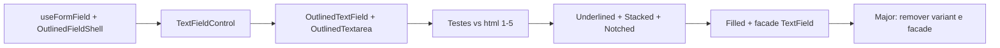

# Arquitetura: variantes de campo (TextField, Textarea, FormField)

Documento de referência para a refatoração do `TextField` monolítico em variantes explícitas, reutilização com `Textarea` e evolução do `FormField`.

---

## Contexto

Hoje o pacote expõe um único `TextField` com prop `variant` (`outline` | `filled` | `underlined`) e um `FormField` genérico que envolve o control (label fora, description, erro, a11y). O `Textarea` reutiliza o mesmo `FormField` e as mesmas props de variante.

Pretende-se:

1. Substituir o modelo “um componente, N variants” por **componentes explícitos por layout visual**.
2. Adicionar **duas variantes novas** inspiradas no Tailwind UI (referências em `html/`).
3. Alinhar a estrutura do control com **label fora + grid para ícones** onde fizer sentido.
4. Reutilizar chrome de formulário no **`Textarea`** sem duplicar lógica de a11y.

---

## Referências visuais (`html/`)

Ficheiros em `html/` são **referência de layout** (markup Tailwind UI). Onde há interação com componentes do pacote (`Button`), existem também `.vue` / `.tsx`.

| Ficheiro                    | Padrão                                   | Variante alvo                        |
| --------------------------- | ---------------------------------------- | ------------------------------------ |
| `text-field-1.html`         | Label + corner opcional + input outlined | Outlined                             |
| `text-field-2.html`         | Label + input com ícone (CSS grid)       | Outlined                             |
| `text-field-3.html`         | Label + prefixo de texto (`https://`)    | Outlined                             |
| `text-field-4.html`         | Label + prefixo + `<select>` no fim      | Outlined (slot até existir `Select`) |
| `text-field-5.html`         | Label + input com ícone + ação           | Outlined + `Button` no `#end`        |
| `text-field-5.vue` / `.tsx` | Implementação Bridge UI                  | `TextField` + `Button`               |
| `text-field-6.html`         | Label **dentro** do container (stacked)  | Stacked                              |
| `text-field-7.html`         | Label **na borda** (notched / floating)  | Notched                              |
| `text-field-8.html`         | Input com linha inferior (underlined)    | Underlined                           |

### Padrão para ações (`text-field-5`)

O HTML original usa `flex` com input `rounded-l` e botão `rounded-r` separados. Na Bridge UI o padrão recomendado é **`Button` no slot `#end` do `TextField`** (um único container com ring), não replicar o layout split do Tailwind como variante de primeira classe.

```vue
<TextField
  label="Search candidates"
  placeholder="John Smith"
  :start-icon="Users"
>
  <template #end>
    <Button
      text="Sort"
      size="sm"
      color="gray"
      variant="light"
      :start-icon="ArrowUpFromLine"
      :classes="{ root: 'h-full min-h-0 shadow-none' }"
    />
  </template>
</TextField>
```

---

## Problema do `TextField` monolítico

Com `variant` único:

- **Stacked** e **notched** exigem **árvore DOM diferente** (label dentro do box ou sobre a borda), não só classes no `container`.
- Props e slots deixam de ser honestos (`corner` no header não combina com label flutuante na borda).
- `v-if` por variant dentro de um `.vue` cresce e fica difícil de testar e documentar.

**Conclusão:** variantes com layout estruturalmente diferente devem ser **componentes públicos separados**.

---

## Opções consideradas

### A) Um `TextField` + prop `variant` (atual)

- Prós: API pequena.
- Contras: templates condicionais, API ambígua para stacked/notched.

### B) Cinco `FormField` + cinco `TextField` + cinco `Textarea`

- Prós: `Textarea` partilha shells.
- Contras: risco de 5× duplicação de template/hook se cada `FormField` for “completo”; 10 componentes públicos se a lógica não for centralizada.

### C) Cinco `TextField` + cinco `Textarea`, remover `FormField`

- Prós: API óbvia (`OutlinedTextField`).
- Contras: **10 superfícies**; drift em a11y/erro/tamanhos se a lógica for copiada em cada um.

### D) Recomendado: hook único + shells + controls + componentes compostos

- Prós: reutilização real, `Textarea` alinhado, sem duplicar `useFormField`.
- Contras: mais ficheiros internos (aceitável).

---

## Arquitetura recomendada

```text
useFormField (ou useField)
  └── lógica única: label, corner, required, description, errorMessage,
      controlId, aria-describedby, disabled, readonly, registry Bridge UI

FieldShell * (templates finos por layout de label/chrome)
  ├── OutlinedFieldShell    ← equivalente ao FormField atual (label fora, acima)
  ├── FilledFieldShell      ← mesmo layout de label; classes de container diferentes
  ├── UnderlinedFieldShell
  ├── StackedFieldShell     ← label dentro / acima do valor no mesmo box
  └── NotchedFieldShell     ← label absoluto na borda do outline

Control * (por tipo de elemento)
  ├── TextFieldControl      ← grid para ícones, start/end, input
  └── TextareaControl       ← container + textarea (+ autosize)

Componentes públicos = FieldShell + Control
  ├── OutlinedTextField, OutlinedTextarea
  ├── FilledTextField, FilledTextarea
  ├── UnderlinedTextField, UnderlinedTextarea
  ├── StackedTextField, StackedTextarea
  └── NotchedTextField, (NotchedTextarea opcional no v1)
```

### Responsabilidades

| Camada                        | Responsabilidade                                                                              |
| ----------------------------- | --------------------------------------------------------------------------------------------- |
| **`useFormField`**            | Estado, merges, binds, slots de chrome; **nunca duplicar**                                    |
| **`FieldShell`**              | Onde e como o label aparece; header; description/erro abaixo do control                       |
| **`TextFieldControl`**        | `<input>`, adornos (`start`/`end`, ícones, slots), classes de variant no container do control |
| **`TextareaControl`**         | `<textarea>`, container, autosize; sem adornos complexos salvo extensão futura                |
| **`OutlinedTextField`, etc.** | Defaults, tipos, export público, testes                                                       |

### O que fazer com `FormField`

- **Manter** o hook `useFormField` como núcleo.
- O componente `FormField` atual pode tornar-se **`OutlinedFieldShell`** ou permanecer como alias de `OutlinedFieldShell`.
- **Não remover** o chrome partilhado; evitar 5 hooks ou 5 cópias de lógica de a11y.

### Stacked e Notched não são “só mais um FormField”

O `FormField` atual assume **header acima do slot**:

```vue
<!-- FormField.vue (simplificado) -->
<div> <!-- root -->
  <div v-if="label || corner"> <!-- header -->
    <label :for="controlId">...</label>
  </div>
  <slot /> <!-- control -->
  <p v-if="description">...</p>
  <p v-if="errorMessage">...</p>
</div>
```

- **Stacked:** o label vive **dentro** do container com borda (`text-field-6.html`).
- **Notched:** o label fica **sobre a borda** com fundo que “corta” o outline (`text-field-7.html`).

Por isso shells dedicados (`StackedFieldShell`, `NotchedFieldShell`) são preferíveis a cinco clones do mesmo `FormField.vue`.

### Markup do control (Outlined)

Para outlined/filled/underlined com label fora, o control segue o padrão Tailwind UI:

```html
<label for="…" class="block …">Email</label>
<div class="mt-2 grid grid-cols-1">
  <input class="col-start-1 row-start-1 …" />
  <svg class="pointer-events-none col-start-1 row-start-1 …" />
</div>
```

Isso substitui o padding assimétrico manual quando há ícone à esquerda.

---

## `Textarea` por variante

| Variante   | Textarea no v1? | Notas                                                  |
| ---------- | --------------- | ------------------------------------------------------ |
| Outlined   | Sim             | Paridade com hoje                                      |
| Filled     | Sim             |                                                        |
| Underlined | Sim             |                                                        |
| Stacked    | Sim             | Comum em formulários                                   |
| Notched    | Opcional        | Menos usual; pode ficar só em `TextField` inicialmente |

`OutlinedTextarea` = `OutlinedFieldShell` + `TextareaControl` — **mesmo shell**, control diferente.

---

## Componentes públicos (naming)

Alinhar nomes de export com intenção; no core hoje a chave é `"outline"` — decidir num major:

- Renomear para `outlined` no registry, **ou**
- Manter chave interna `outline` e export público `OutlinedTextField`.

Sugestão de exports:

- `OutlinedTextField`, `FilledTextField`, `UnderlinedTextField`, `StackedTextField`, `NotchedTextField`
- `OutlinedTextarea`, `FilledTextarea`, `UnderlinedTextarea`, `StackedTextarea`, (`NotchedTextarea`)

Hooks/utils internos (não exportar de início, salvo necessidade):

- `useFormField`
- `useTextFieldControl` (extrair de `useTextField` atual)
- `useTextareaControl` (extrair de `useTextarea` atual)

---

## Migração (fases)



1. **Extrair** `TextFieldControl` do `TextField` / `useTextField` atual.
2. **OutlinedFieldShell** ≈ `FormField` (pode ser rename).
3. **OutlinedTextField** e **OutlinedTextarea** (cobre casos 1–5 em `html/`).
4. Testes unitários + Cypress alinhados aos `html/`.
5. **Underlined**, **Stacked**, **Notched** (DOM específico).
6. **Filled** (label fora, container filled).
7. **Facade** `TextField` com `variant` → delega para o componente certo; marcar deprecado.
8. **Major:** remover `variant` e facade.

---

## Registry / `@bridge-ui/core`

- Tokens de `variant` no core podem passar de um mapa único `TextFieldVariant` para módulos por família (`Outlined`, `Stacked`, …) ou manter layered classes partilhadas onde o visual coincide (ex.: `color`, `size`).
- `FormField` no config (`BridgeUIConfig`) permanece para defaults de label/description; shells podem registar overrides por componente (`OutlinedTextField`, etc.).

---

## O que evitar

- Remover `FormField` / `useFormField` e copiar lógica em 10 componentes.
- Cinco `FormField` completos, cada um com o seu hook.
- Suportar layout split Tailwind (input e botão com `rounded-l` / `rounded-r` separados) como API oficial.
- Forçar `corner` + label notched no mesmo modelo mental do header atual.
- Converter todos os `.html` para `.vue` — só onde há `Button` ou outros componentes do pacote.

---

## Resumo executivo

| Pergunta                 | Resposta                                                                         |
| ------------------------ | -------------------------------------------------------------------------------- |
| 5 `TextField` separados? | **Sim**, como API pública.                                                       |
| 5 `FormField` separados? | **Não** como 5 hooks; **sim** como 3–5 **shells** finos + **um** `useFormField`. |
| 5 `Textarea`?            | **Sim**, compostos com o **mesmo shell** da variante + `TextareaControl`.        |
| Remover `FormField`?     | **Não**; evoluir para `OutlinedFieldShell` (e afins).                            |
| Referência `html/`?      | Mapa visual; implementação em componentes + `text-field-5.vue` para `Button`.    |

**Princípio:** uma lógica de formulário, vários layouts de shell, dois tipos de control, componentes públicos = shell + control.
